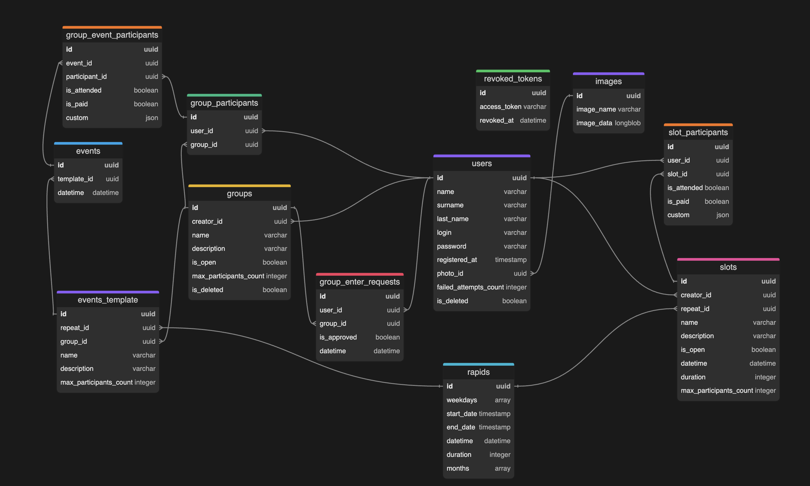

# База данных

## users

Информация о пользователе.

`login` - уникальное поле  
`password` - хешированный пароль  
`photo_id` - id фотографии  

## images

Информация о картинках пользователей

`image_name` - название файла  
`image_data` - base64 формат картинки

## groups

Информация о группах для проведеиня занятий. Группы могут быть закрытые и открытые. Все пользователи группы должны присутсовать на всех занятиях, которые создаются управляющим группы.  
В открытые могут вступать все желающие и если есть места.  
В закрытые можно вступив, отправив запрос на вступление, которые рассмотрит создатель группы.  

`creator_id` - id пользователя, который создал группу

## group_enter_requests

Зарпосы на вступление в закрытую группу.

`user_id` - id пользователя, который отправил запрос  
`group_id` - id группы в которую пользовател хочет вступить  
`datetime` - дата и время создания запроса
`is_approved` - флаг, о принятом или отклоненном запросе. 
- По уомлчанию NULL - запрос еще не рассмотрен.  
- True - запрос удовлетворен и пользователь заносится в таблицу **group_participants**   
- False - запрос не удовлетворен.

Администратор может изменить свое решение и принять участника в группу

## group_participants

Информация о участинках групп. Пользователи могут состоять в нескольких группах. 

`group_id` - id группы  
`user_id` - id пользователя  

## events_template

Оригинал события или одного занятия, которое создает создатель группы. Он указывает описание и название занятия и указывает частоту повторение занятия.

`group_id` - группа в которой это событие происходит  
`repeat_id` - ссылка на **rapids** таблицу с указанием частот  

## events

Частные события, которые являются "наследниками" **events_templates**. 

Имеют характеристики того события на которое указывает поле `template_id`.   
`datetime` - дата и время в которое проходит конкретно это событие 

Частные события создаются в момент начала занятия администратором группы. Те он видит в интерфейсе, что у него по rapids сейчас должно занятие начаться, он нажимает кнопку и создается конкретно это занятие сейчас

## group_event_participants

Информация об участниках одного конкретного события.

О каждом участнике ведется информация о том присутствовал ли он, оплачено ли занятие или свои кастомные параметры

## slots

Функционал слотов. Схож с событиями, только минуется слой с группами. Каждый слот это одновременно и группа и занятие. Оно тоже может повторяться. Пользователи могут вступить в открытый только слот. В закрытый лишь по приглашению создателя. У этого слота указана частота повторения данного слота (может и единожды)

## slot_participants
@TODO: доработать  
Информация об участниках одного конкретного слота. Идет лишь ссылка по `slot_id` к **slots** чтобы указать наследник какого слота эта запись

<i>Расширение для просмотра в VS CODE: `bocovo.dbml-erd-visualizer`
</i>
 06/01/25